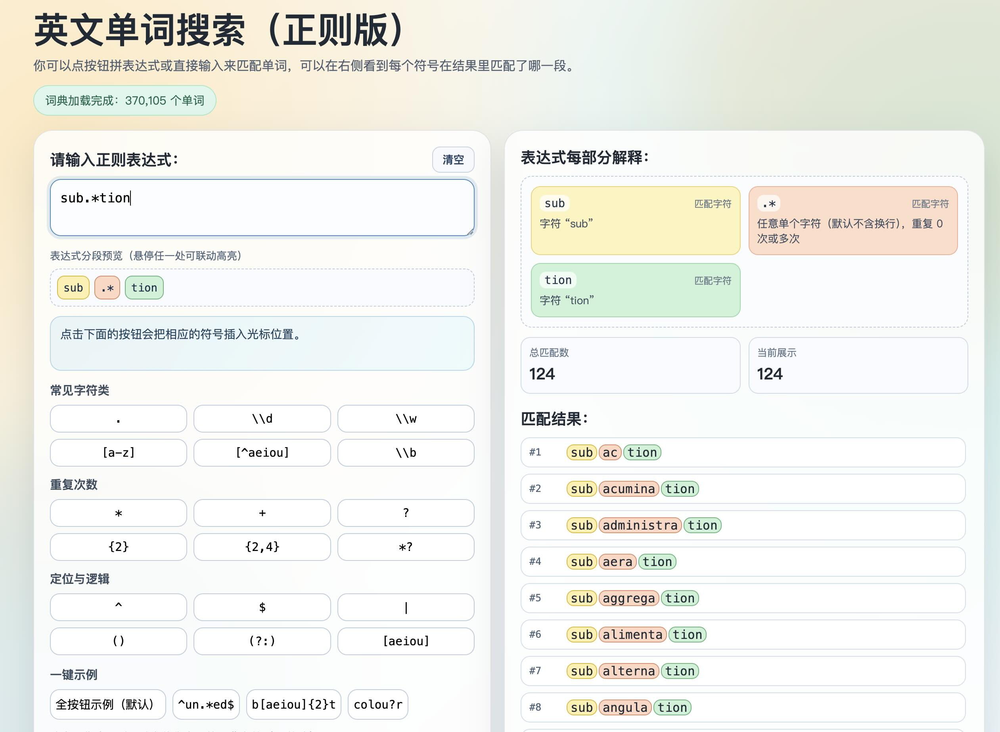

# English Word Search Tool (With Regex)

This utility leverages Regular Expressions (Regex) to facilitate precise English word retrieval.  

It could serves as an efficient study aid for GRE and other standardized tests, enabling users to aggregate words with identical prefixes or suffixes for enhanced memorization.

The underlying dataset is sourced from the  repository [https://github.com/dwyl/english-words](https://github.com/dwyl/english-words).